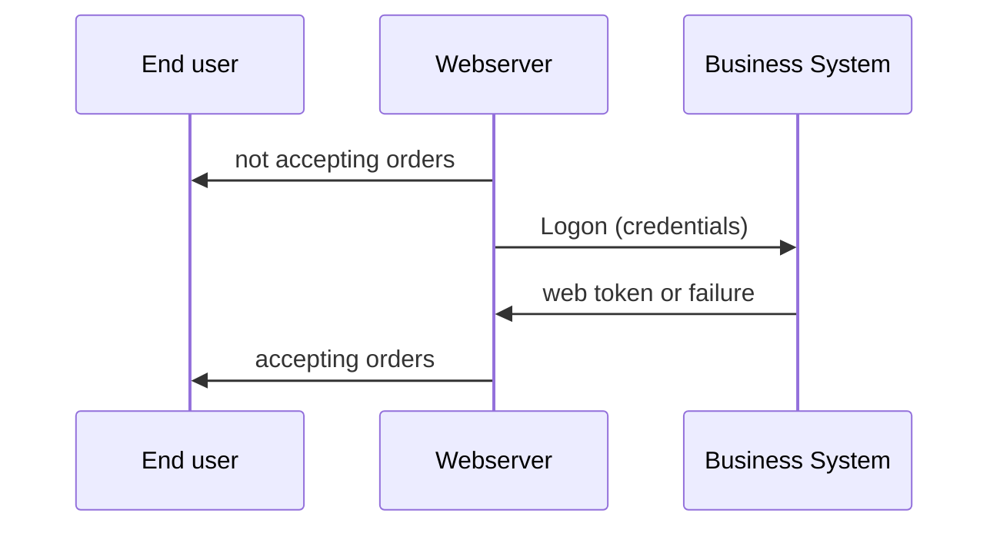

# SmartEscrowContract
Creating a benchmark contract for Escrow payments

## Example System start up & restart

```mermaid 
sequenceDiagram
participant C as End user 
participant W as Webserver 
participant B as Business System 
W->>C: not accepting orders
W->>B: Logon (credentials) 
B->>W: web token or failure
W->>C: accepting orders
```
